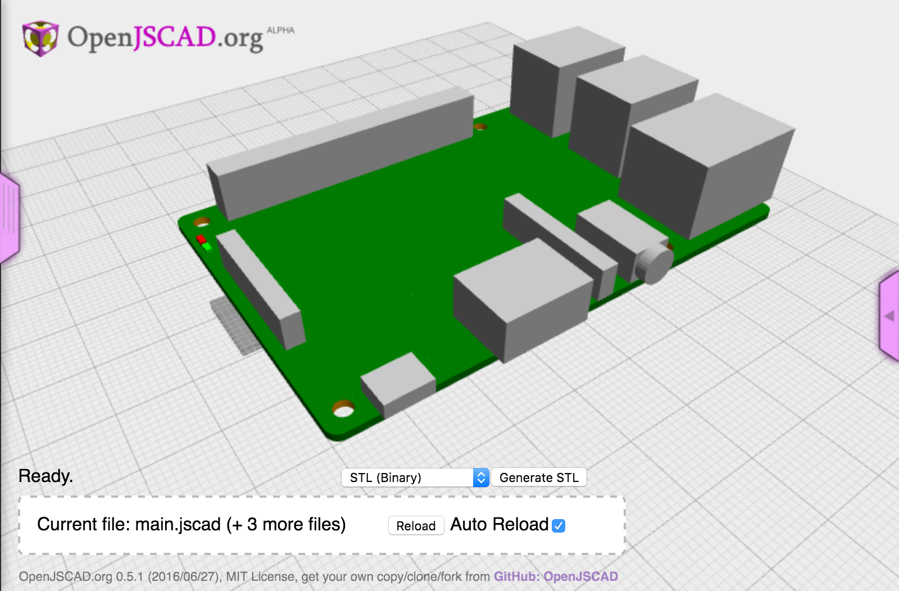

[](https://www.npmjs.org/package/jscad-raspberrypi) [](https://www.npmjs.org/package/jscad-raspberrypi)

# jscad-raspberrypi
This is a collection of jscad parts that model a RaspberryPi BPlus and various Hats.  These models use the [jscad-utils]() library and return jscad-utils `group` objects.

For an example, see the [yeoman jscad generator](https://www.npmjs.com/package/generator-jscad) which will create a project that uses this library.

## Installation
Install `jscad-raspberrypi` using NPM:

```bash
npm install --save jscad-raspberrypi
```

## Basic usage
To use the utilities, you need to include the `jscad-raspberrypi.jscad` file and a copy of `lodash`.

```javascript
include('node_modules/jscad-utils/jscad-utils.jscad');
include('node_modules/jscad-raspberrypi/jscad-raspberrypi.jscad');
include('node_modules/lodash/lodash.js');

main() {
  util.init(CSG);

  var BPlus = RaspberryPi.BPlus();

  return BPlus.combine();
}
```


## API Reference

### RaspberryPi
jscad-raspberrypi


* [RaspberryPi](#module_RaspberryPi) : <code>Object</code>
    * [.BPlus()](#module_RaspberryPi.BPlus)
    * [.Hat()](#module_RaspberryPi.Hat)
    * [.PiTFT24()](#module_RaspberryPi.PiTFT24)
    * [.CameraModule()](#module_RaspberryPi.CameraModule)

<a name="module_RaspberryPi.BPlus"></a>

### RaspberryPi.BPlus()
Returns a complete RaspberryPi B Plus model.


**Kind**: static method of <code>[RaspberryPi](#module_RaspberryPi)</code>  
<a name="module_RaspberryPi.Hat"></a>

### RaspberryPi.Hat()
Returns an empty Pi Hat.


**Kind**: static method of <code>[RaspberryPi](#module_RaspberryPi)</code>  
<a name="module_RaspberryPi.PiTFT24"></a>

### RaspberryPi.PiTFT24()
Returns an Adafruit PiTFT 2.4 Hat with buttons.


**Kind**: static method of <code>[RaspberryPi](#module_RaspberryPi)</code>  
<a name="module_RaspberryPi.CameraModule"></a>

### RaspberryPi.CameraModule()
Returns an Pi camera module.


**Kind**: static method of <code>[RaspberryPi](#module_RaspberryPi)</code>  

&copy; 2016 John Cole <johnwebbcole@gmail.com>. Documented by [jsdoc-to-markdown](https://github.com/75lb/jsdoc-to-markdown).
