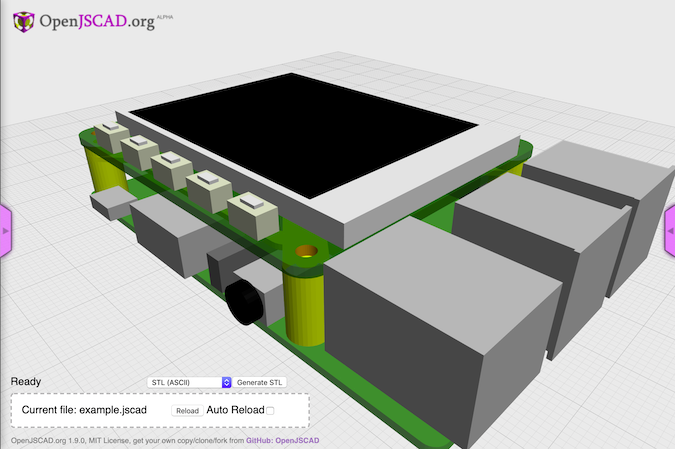

[](https://www.npmjs.org/package/jscad-raspberrypi) [](https://www.npmjs.org/package/jscad-raspberrypi)


# jscad-raspberrypi


This is a collection of jscad parts that model a RaspberryPi BPlus and various Hats. These models use the [jscad-utils](https://github.com/johnwebbcole/jscad-utils) library and return jscad-utils [`group` objects](https://github.com/johnwebbcole/jscad-utils#utilgroupnames-objects--object).

## Installation

Install `jscad-raspberrypi` using NPM:

```bash
npm install --save jscad-raspberrypi
```

## Basic usage

To use the utilities, you need to include the `jscad-raspberrypi.jscad` file and a copy of `lodash`.

```javascript
include('node_modules/jscad-utils/jscad-utils.jscad');
include('node_modules/jscad-raspberrypi/jscad-raspberrypi.jscad');
include('node_modules/lodash/lodash.js');
main() {
  util.init(CSG);
  var BPlus = RaspberryPi.BPlus();
  return BPlus.combine();
}
```

## Yeoman Generator

You can use the [yeoman jscad generator](https://www.npmjs.com/package/generator-jscad) which will create a project that uses this library.
Once you create your project, install `jscad-raspberrypi`, and run `gulp`. Dragging the `dist` directory into [http://openjscad.org/](http://openjscad.org/) will include this library.
Modify your `main.jscad` file to return a RaspberryPi object.

```javascript
// include:js
// endinject
/* exported main, getParameterDefinitions */
/* globals piexample */
function main(params) {
  util.init(CSG);
  return RaspberryPi.BPlus().combine();
}
```

## Examples

Examples are placed in the `dist` directory. This allows the files to be included directly into openjscad.org.

Here are some of the examples:

- [example](http://openjscad.org/#https://gitlab.com/johnwebbcole/jscad-raspberrypi/raw/master/dist/examples/example.jscad) an example showing how to combine several parts.
- [bplus](http://openjscad.org/#https://gitlab.com/johnwebbcole/jscad-raspberrypi/raw/master/dist/examples/bplus.jscad) an example bplus board.
- [bplus3](http://openjscad.org/#https://gitlab.com/johnwebbcole/jscad-raspberrypi/raw/master/dist/examples/bplus3.jscad) an example bplus modle 3 board.
- [camera-module-v1](http://openjscad.org/#https://gitlab.com/johnwebbcole/jscad-raspberrypi/raw/master/dist/examples/camera-module-v1.jscad) an example camera module version 1.
- [camera-module-v2](http://openjscad.org/#https://gitlab.com/johnwebbcole/jscad-raspberrypi/raw/master/dist/examples/camera-module-v2.jscad) an example camera module version 2.
- [hat-standoff](http://openjscad.org/#https://gitlab.com/johnwebbcole/jscad-raspberrypi/raw/master/dist/examples/hat-standoff.jscad) an example standoff.
- [hat](http://openjscad.org/#https://gitlab.com/johnwebbcole/jscad-raspberrypi/raw/master/dist/examples/hat.jscad) an example hat.
- [pi-tft22](http://openjscad.org/#https://gitlab.com/johnwebbcole/jscad-raspberrypi/raw/master/dist/examples/pi-tft22.jscad) an example Adafruit TFT22.
- [pi-tft24](http://openjscad.org/#https://gitlab.com/johnwebbcole/jscad-raspberrypi/raw/master/dist/examples/pi-tft24.jscad) an example Adafruit TFT24.
- [spacer](http://openjscad.org/#https://gitlab.com/johnwebbcole/jscad-raspberrypi/raw/master/dist/examples/spacer.jscad) an example spacer.

&copy; 2016 John Cole <johnwebbcole@gmail.com>.
